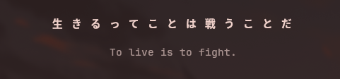

# kotofetch

kotofetch is a small, configurable CLI tool that displays Japanese quotes in the terminal. It comes with built-in quotes and allows users to customize display options such as padding, width, translation display, and text styles.



## Installation

### Arch Linux / AUR
You can install the stable release from the AUR:

```bash
yay -S kotofetch
```

> When prompted, choose All to clean-build the package from the downloaded PKGBUILD.

Or clone and build manually from [here](https://aur.archlinux.org/packages/kotofetch):
```bash
git clone https://aur.archlinux.org/kotofetch.git
cd kotofetch
makepkg -si
```

### Prebuilt Binaries for Linux
You can download prebuilt binaries from the [Releases](https://github.com/hxpe-dev/kotofetch/releases). Available formats:
- **tar.gz** (generic Linux)
- **.deb** (Debian / Ubuntu)
- **.rpm** (Fedora / CentOS / openSUSE)

### From Source
Requires **Rust** and **Cargo**:

```bash
git clone https://github.com/hxpe-dev/kotofetch.git
cd kotofetch
cargo install --path .
```

After installation, you can run `kotofetch` from anywhere in your terminal.

## Configuration

### Config File

User configuration lives in:

```
~/.config/kotofetch/config.toml
```

Here you can customize:
- `horizontal_padding` / `vertical_padding` - spacing around quotes
- `width` - max width for text wrapping (`0` for automatic width)
- `show_translation` - translation mode (`"none"`, `"english"`, `"romaji"`)
- `translation_color` - named ANSI colors (`"red"`, `"yellow"`, `"dim"`, etc.) or hex (`"#ffcc00"`)
- `font_size` - small, medium, or large (adds spacing between characters)
- `bold` - bold Japanese text (true/false)
- `border` - show a box border (true/false)
- `rounded_border` - show rounded border (need `border` to be enabled) (true/false)
- `source` - show the quote source (true/false)
- `modes` - list of default quote modes (`["proverb", "haiku", "anime"]`)
- `seed` - RNG seed for random quotes (`0` for random seed)
- `centered` - center text (true/false)

Example `config.toml`:
```toml
[display]
horizontal_padding = 3
vertical_padding = 1
width = 50
show_translation = "romaji"
translation_color = "dim"
font_size = "medium"
bold = true
border = true
rounded_border = true
source = true
modes = ["proverb", "anime"]
seed = 0
centered = true
```

### Custom quotes
Built-in quotes are embedded in the binary. To add your own quotes, create:
```
~/.config/kotofetch/quotes/
```

Place `.toml` files there with the same structure as the built-in ones (`proverbs.toml`, `haiku.toml`, `anime.toml`, see [this](https://github.com/hxpe-dev/kotofetch/tree/main/quotes)). These will automatically merge with the built-in quotes.

## Usage
```bash
kotofetch                           # display a quote following the config
kotofetch --horizontal-padding 3    # override specific config parameter temporarily
```

## Contributing
Contributions are welcome! Here's how you can help:
1. **Fork** the repository.
2. **Clone** your fork locally:
```bash
git clone https://github.com/YOUR_USERNAME/kotofetch.git
cd kotofetch
```
3. **Create a branch** for your changes:
```bash
git checkout -b feature/my-feature
```

4. **Make changes** and **commit**:
```bash
git add .
git commit -m "Add my feature"
```

5. **Push** your branch:
```bash
git push origin feature/my-feature
```

6. **Open a Pull Request** on GitHub!

---

Made with ❤️ by [hxpe](https://github.com/hxpe-dev)  
If you enjoy **kotofetch**, consider starring the [GitHub repository](https://github.com/hxpe-dev/kotofetch)!
